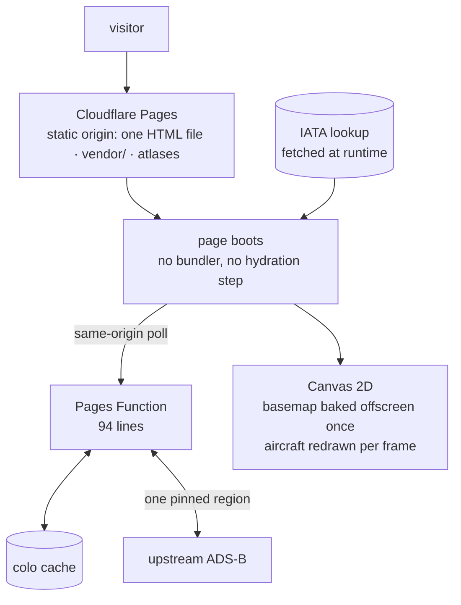
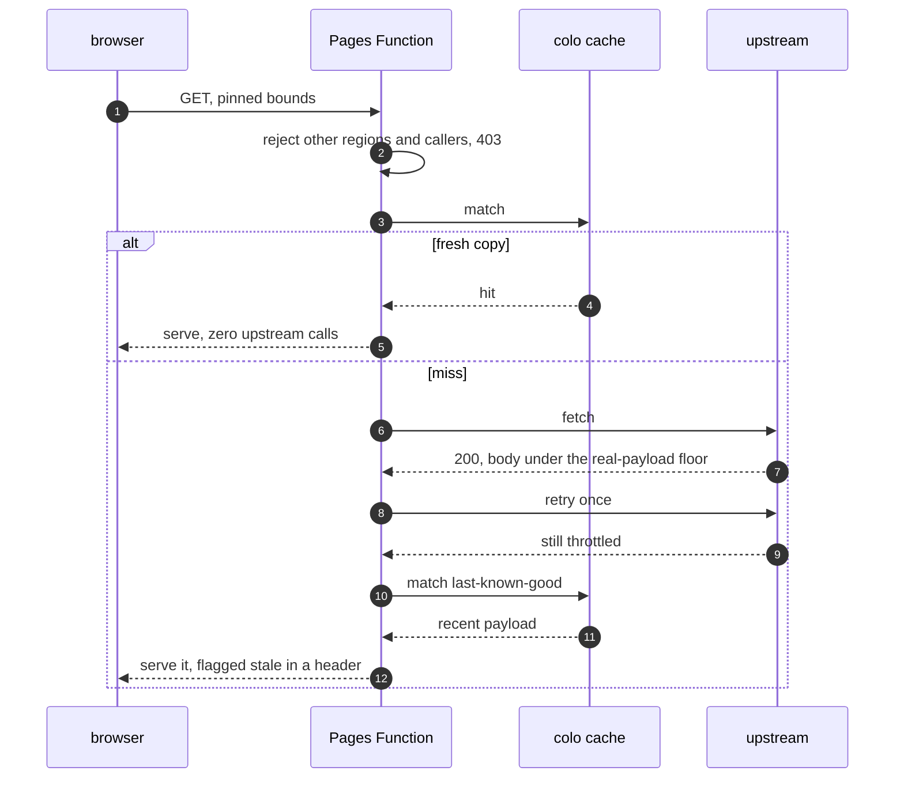
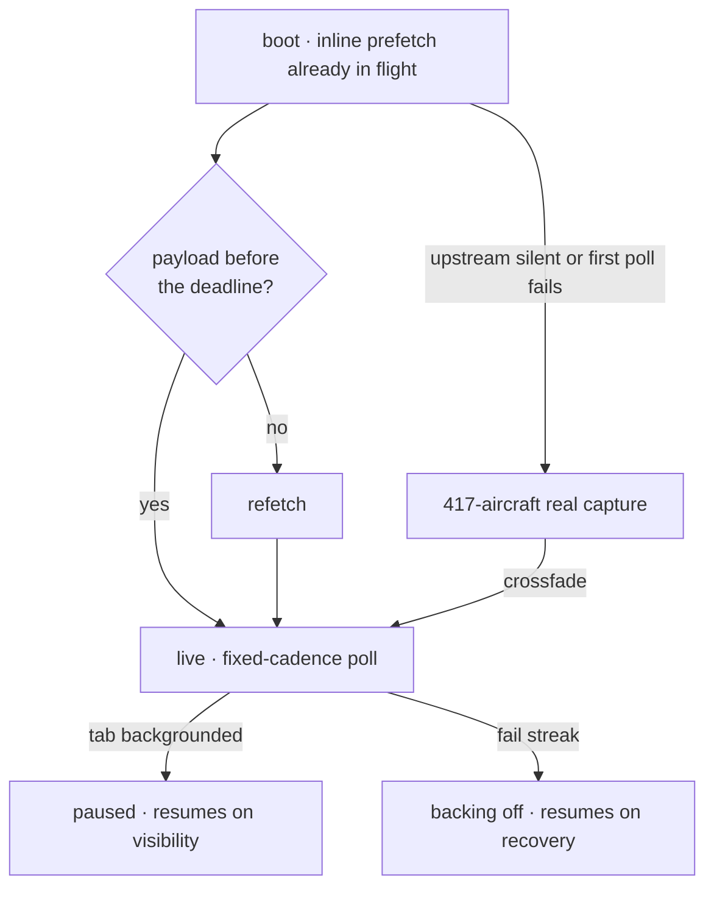

  

  Personal site with a live ADS-B map in the hero. One 215 KB HTML file, no build step, and an edge proxy that treats a <code>200</code> as untrusted.

  
  
  
  
  
  
  

## 📊 Overview

Two constraints set before any of it was written. Every decision below follows from them.

| # | Constraint | Ruled out |
|---|---|---|
| 1 | No build step. The deployed artifact is the file I edit. | Bundlers, JSX transforms, a `dist/` I cannot read |
| 2 | Real data only. If the map shows aircraft, they exist. | Synthesised traffic, random walkers, decorative animation |

## 🏗 Architecture

| Concern | Implementation |
|---|---|
| Origin | Cloudflare Pages serves the repo root directly. There is no origin server, and no build output to reconcile against source |
| Network surface | The same-origin Function is the page's only network dependency. The browser contacts no third-party host |
| Dependencies | Libraries and atlases vendored and pinned, so the page also opens from `file://` with network features off |
| Output directory | Pinned in `wrangler.toml`, because the dashboard's stale setting fails every git build |
| Local development | `wrangler pages dev` runs the Function locally, so the proxy path is testable before deploy |
| Caching | `vendor/` immutable, the IATA lookup on a one-day cache, Function responses on a TTL matched to the poll interval |
| Rendering | React as a plain script, markup precompiled, nothing transpiled at request or at deploy time |

---

# 📡 1 · Edge

The upstream soft-throttles scripted access with a `200 OK` carrying a near-empty body. Status codes are
therefore unusable as a health signal, so the Function keys on response size and degrades in stages.

| Mechanism | Reason |
|---|---|
| Response size as the health signal | A throttled reply is `200`, so trusting the status forwards a blank map with every indicator green |
| Cache keyed on my own URL | The upstream response carries cookies, which disables implicit fetch caching |
| TTL matched to the client poll interval | Concurrent visitors collapse onto one upstream request |
| One immediate retry | Empties are frequently per-request flukes on the upstream balancer |
| Last-known-good fallback, header-flagged | Aircraft drift ~2 px/min at this zoom, so a slightly old payload is visually identical and the degradation stays observable to me |
| Bounds pin plus caller allow-list, absent-Referer permitted | Prevents reuse as a general relay without breaking privacy-hardened browsers |

---

# 🗺 2 · Hero map

| Technique | Effect |
|---|---|
| Prefetch before the framework mounts, raced against a deadline | First payload in flight during parse |
| Frozen real capture as initial state | Never empty on first paint, never synthetic |
| Basemap baked once to an offscreen canvas | Per-frame work is aircraft only, not reprojection |
| Visibility-gated polling, fail-streak backoff, expiring trails | No background polling, no punished upstream, bounded memory |

---

# ⚡ 3 · Page

One scroll value reaches every scene, so an unguarded page re-renders fully per frame.

| Control | Effect |
|---|---|
| Scenes memoised ignoring the scroll value | Excluded from scroll renders entirely |
| Static subtrees memoised | Skipped inside the scenes that do re-render |
| Blur filter removed from background gradients | It measured as the most expensive paint |
| No persistent `will-change`, backdrop blurs reduced from spec | Memory and compositing cost |
| Reveals bound to section titles only | Per-block reveals measured and rejected |
| Motion hand-rolled, no library | Gated on `prefers-reduced-motion` throughout |
| Dynamic viewport units | A mobile URL bar cannot break centring, and the pre-hydration shell matches the same geometry |
| Landmarks, focus rings, described sliders, canvas with a text alternative | Keyboard and screen-reader reachable |

---

# 🚀 CI/CD and deployment

| Target | Trigger | Mechanism |
|---|---|---|
| Site | Push to `main` | Pages builds from the repo root. With no build step the deploy is a copy, so what I tested is byte-identical to what ships |
| Edge Function | Push to `main` | Deployed on the same commit, so the page and its proxy cannot version-skew |
| Vendored library upgrade | Manual | **Rename the file.** `vendor/` is cached immutably, so replacing bytes at a stable path serves the old library indefinitely |

Three things bite here if you forget them. The dashboard's output-dir setting fails every git build, so it is
pinned in config. The runtime IATA lookup ships as a separate asset, and without it the red-plane logic
silently no-ops. And the proxy cannot be exercised by opening the file, so it is tested through the local
Pages runtime instead.

## 🔒 Security headers

| Layer | Carries |
|---|---|
| Meta-tag CSP | Script, style, font and connection origins as an explicit allow-list, no wildcards, `object-src` and `base-uri` none |
| `_headers` | What a meta CSP cannot express: nosniff, referrer policy, permissions policy, framing |

---

# 🔴 Undocumented by design

Some aircraft render red. The selecting rule is computed client-side from the live feed and is written
neither on the page nor here.

# 🧰 Stack

| Layer | Built with | Size |
|---|---|---|
| Page | One HTML file · precompiled React 18 · no build step | 215 KB, 35 components, 153 element calls |
| Map | d3-geo · d3-array · topojson-client · world-atlas · Canvas 2D | Libraries vendored and pinned |
| Edge | Cloudflare Pages · Pages Functions · cache API · header rules | One Function, 94 lines |
| Data | Live ADS-B through the pinned proxy · runtime IATA lookup | 36 commits since 2026-04-01 |

  <a href="https://klauslila.com">Klaus Lila</a> ·
  <a href="https://github.com/klauslila/skaisearch-showcase">skaisearch write-up</a>

