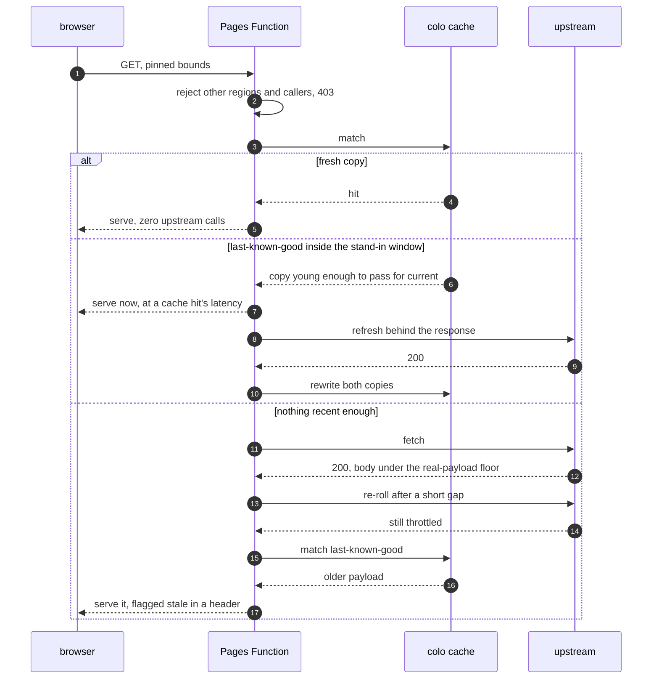
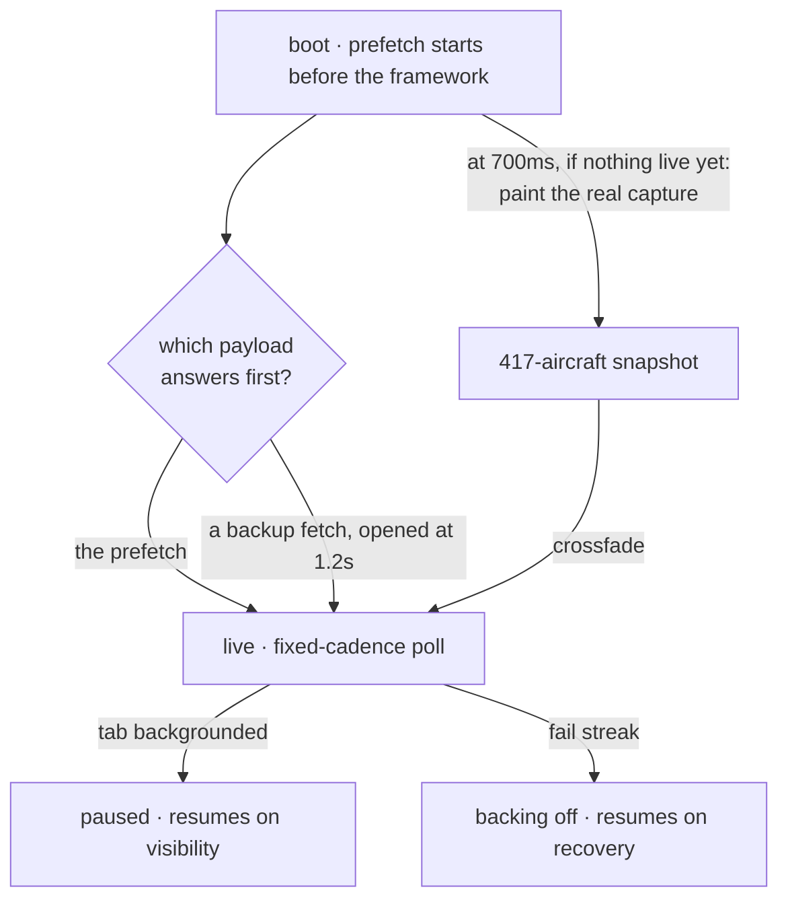

  

  Personal site with a live ADS-B map in the hero. One 215 KB HTML file, no build step, and an edge proxy that treats a <code>200</code> as untrusted.

  
  
  
  
  
  
  

## 📊 Overview

Two non-functional requirements set before any of it was written. Every decision below follows from them.

| # | Requirement | Ruled out |
|---|---|---|
| 1 | No build step. The deployed artifact is the file I edit. | Bundlers, JSX transforms, a `dist/` I cannot read |
| 2 | Real data only. If the map shows aircraft, they exist. | Synthesised traffic, random walkers, decorative animation |

## 🏗 Architecture

| Concern | Implementation |
|---|---|
| Origin | Cloudflare Pages serves one directory of static files. There is no origin server, and no build step whose output could drift from source |
| Network surface | The same-origin Function is the page's only network dependency. The browser contacts no third-party host |
| Dependencies | Libraries and atlases vendored and pinned, so the page also opens from `file://` with network features off |
| Output directory | Only `public/` is deployed, pinned in `wrangler.toml`. Pages serves everything in the output directory and has no exclusion mechanism, so pointing it at the repo root also published the project's instruction and config files as fetchable URLs. Documentation and configuration now live outside the deployed directory |
| Unknown paths | A real `404.html`. Without one, Pages falls back to `index.html` with a 200, so every wrong URL quietly renders the site instead of failing |
| Local development | `wrangler pages dev` runs the Function locally, so the proxy path is testable before deploy |
| Caching | `vendor/` immutable, the IATA lookup on a one-day cache, Function responses on a TTL matched to the poll interval |
| Rendering | React as a plain script, markup precompiled, nothing transpiled at request or at deploy time |

---

# 📡 1 · Edge

The upstream soft-throttles scripted access with a `200 OK` carrying a near-empty body. Status codes are
therefore unusable as a health signal, so the Function keys on response size and degrades in stages. The
stored copy that covers a throttled upstream earns a second job: it also keeps the round trip out of the
request path, because a cache miss answers from it and refreshes afterwards rather than making the visitor
wait.

| Mechanism | Reason |
|---|---|
| Response size as the health signal | A throttled reply is `200`, so trusting the status forwards a blank map with every indicator green |
| Cache keyed on my own URL | The upstream response carries cookies, which disables implicit fetch caching |
| TTL matched to the client poll interval | Concurrent visitors collapse onto one upstream request |
| Spaced re-rolls rather than one immediate retry | The upstream rations by request count and not by a time window. Roughly a third of calls come back empty at the poll cadence, and back-to-back tries fare worst, so an empty is odds to re-roll rather than a window to wait out. The refresh running behind a response gets one roll more than the blocking path, where a visitor is waiting on it |
| Degraded responses go out uncacheable | The client answers an empty with fast retries. Any `max-age` on that response turns each retry into a replay of the same failure out of the browser cache, so the recovery path reads as correct while issuing no requests at all |
| A miss inside the stand-in window answers from cache and refreshes behind the response | The upstream round trip measured roughly twelve times a cache hit. Paying it inside the request was what pushed first data past the loading overlay, so the hero fell back to the stored capture and then had to swap. Answering from the last copy removes the swap rather than hiding it |
| Stand-in window kept far shorter than the retention window | Three minutes is right for an outage and far too loose for the normal path. The short window keeps drift inside what the client's own poll interval already tolerates |
| Age stamped on the stored copy | The cache API exposes no reliable age for a response the Function wrote itself, and the window is only enforceable if the age is readable |
| Last-known-good fallback, header-flagged | Aircraft drift ~2 px/min at this zoom, so a slightly old payload is visually identical and the degradation stays observable to me |
| Bounds pin plus caller allow-list, absent-Referer permitted | Prevents reuse as a general relay without breaking privacy-hardened browsers |

---

# 🗺 2 · Hero map

| Technique | Effect |
|---|---|
| Prefetch starts before the framework, and is never abandoned: a backup fetch opens at 1.2s and the first answer wins, with the fuse cancelled the moment the prefetch answers | The connections least able to afford it were otherwise paying for the round trip twice. Left armed on success, the backup opened a request nobody was waiting for, into an upstream that rations by request count |
| The real capture paints at 700ms, ahead of the loading overlay lifting at 800ms | The hero is never an empty sky. The overlay lifts on a clock, so the fleet has to be on that clock's timeline rather than the network's |
| Live data arriving first skips the capture entirely; arriving later crossfades over it | No flicker either way |
| Basemap baked once to an offscreen canvas | Per-frame work is aircraft only, not reprojection |
| Visibility-gated polling, fail-streak backoff, expiring trails | No background polling, no punished upstream, bounded memory |

---

# ⚡ 3 · Page

One scroll value reaches every scene, so an unguarded page re-renders fully per frame.

| Control | Effect |
|---|---|
| Scenes memoised ignoring the scroll value | Excluded from scroll renders entirely |
| Static subtrees memoised | Skipped inside the scenes that do re-render |
| Blur filter removed from background gradients | It measured as the most expensive paint |
| No persistent `will-change`, backdrop blurs reduced from spec | Memory and compositing cost |
| Reveals bound to section titles only | Per-block reveals measured and rejected |
| Motion hand-rolled, no library | Gated on `prefers-reduced-motion` throughout |
| Dynamic viewport units | A mobile URL bar cannot break centring, and the pre-hydration shell matches the same geometry |
| Landmarks, focus rings, described sliders, canvas with a text alternative | Keyboard and screen-reader reachable |

---

# 🚀 CI/CD and deployment

| Target | Trigger | Mechanism |
|---|---|---|
| Site | Push to `main` | Pages builds from `public/`. With no build step the deploy is a copy, so what I tested is byte-identical to what ships |
| Edge Function | Push to `main` | Deployed on the same commit, so the page and its proxy cannot version-skew |
| Vendored library upgrade | Manual | **Rename the file.** `vendor/` is cached immutably, so replacing bytes at a stable path serves the old library indefinitely |

Three things bite here if you forget them. The dashboard's output-dir setting fails every git build, so it is
pinned in config. A lookup table ships as a separate runtime asset, and if it goes missing the styling it
feeds silently no-ops instead of failing. And the proxy cannot be exercised by opening the file, so it is
tested through the local Pages runtime instead.

## 🔒 Security headers

| Layer | Carries |
|---|---|
| Meta-tag CSP | Script, style, font and connection origins as an explicit allow-list, no wildcards, `object-src` and `base-uri` none |
| `_headers` | What a meta CSP cannot express: nosniff, referrer policy, permissions policy, framing |

---

# 🔴 Undocumented by design

Some aircraft render red. The selecting rule is computed client-side from the live feed and is written
neither on the page nor here.

# 🧰 Stack

<!-- stats:start:selfstats · generated from the working tree and git, do not hand-edit -->
| Layer | Built with | Size |
|---|---|---|
| Page | One HTML file · precompiled React 18 · no build step | 217 KB, 36 components, 157 element calls |
| Map | d3-geo · d3-array · topojson-client · world-atlas · Canvas 2D | Libraries vendored and pinned |
| Edge | Cloudflare Pages · Pages Functions · cache API · header rules | One Function, 167 lines |
| Data | Live ADS-B through the pinned proxy · runtime IATA lookup | 89 commits since 2026-04-01 |
<!-- stats:end:selfstats -->

  <a href="https://klauslila.com">Klaus Lila</a> ·
  <a href="https://github.com/klauslila/skaisearch-showcase">skaisearch write-up</a> 
  © 2024-2026 Klaus Lila. All rights reserved. Not licensed for reuse.

